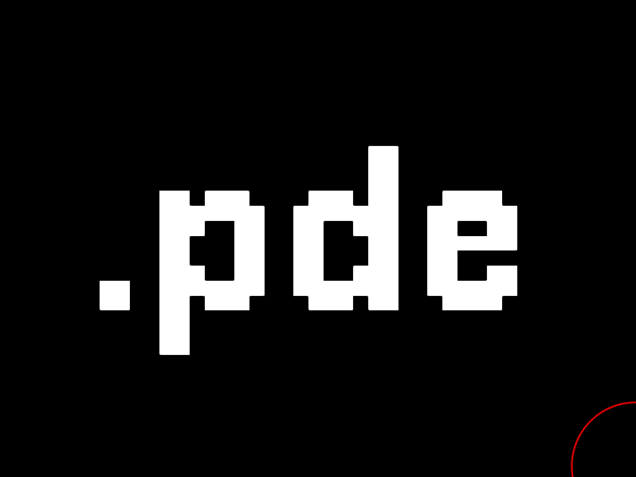

# Distorting Letters

Instructor: André Burnier | Espaço.CC

## DLPoints

files: [DLPoints.pde](./DLPoints)

## DLLetters

files: [DLLetters.pde](./DLLetters)

## DLLine

font: [Pixellari by Zacchary Dempsey-Plante](https://github.com/zedseven/Pixellari)